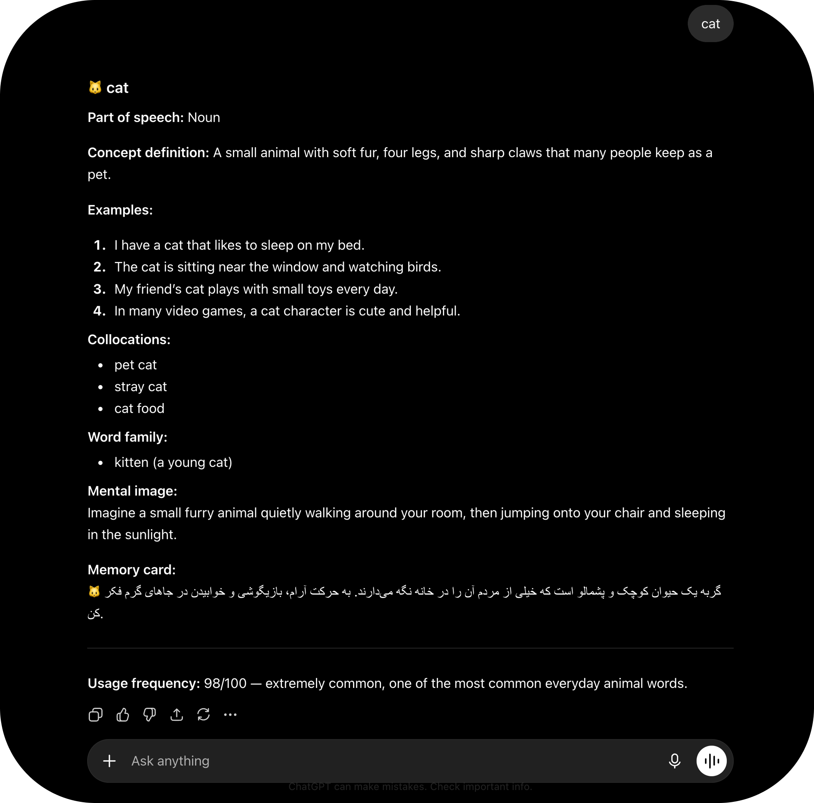

<h1 align="center">Learn English</h1>

Ready-to-use prompts that turn any AI chat into a personalized English tutor for **vocabulary** and **speaking** practice.

پرامپت‌های آماده برای تبدیل چت هوش مصنوعی به معلم شخصی زبان انگلیسی — برای تقویت **واژگان** و **مکالمه**.

 
 

## prompt | پرامپت
<h3 align="left">

→ [Vocabulary prompt | پرامپت واژگان](./Prompts/Vocabulary/Vocabulary.md)

→ [Speaking prompt | پرامپت صحبت کردن](./Prompts/Speaking/Speaking.md)

</h3>

 
 

## Screenshots

##### Vocabulary

 
 

## How to use | نحوه‌ی استفاده

##### Vocabulary
1. Copy the prompt [`here`](./Prompts/Vocabulary/Vocabulary.md) and paste it as the first message in a new chat | پرامپت رو [`از اینجا`](./Prompts/Vocabulary/Vocabulary.md) کپی و به‌عنوان اولین پیام پیست کن
2. Fill in the settings at the top, or leave blank for defaults | تنظیمات بالای پرامپت رو پر کن یا خالی بذار
3. Send any word(s) separated by commas/dashes, e.g. `apple, car` | کلمات رو با کاما یا خط تیره بفرست، مثلاً: `apple, car`
4. Get a structured flashcard for each word | یک کارت آموزشی برای هر کلمه دریافت می‌کنی

 

##### Speaking
1. Copy the prompt [`here`](./Prompts/Speaking/Speaking.md) and paste it as the first message in a new chat | پرامپت رو [`از اینجا`](./Prompts/Speaking/Speaking.md) کپی و به‌عنوان اولین پیام پیست کن
2. Fill in the settings at the top, or leave blank for defaults | تنظیمات بالای پرامپت رو پر کن یا خالی بذار
3. Chat in English like you're talking to a real person | به انگلیسی چت کن، انگار با یک آدم واقعی حرف می‌زنی
4. If you don't understand a message, just say "I didn't understand" (English or your language) for an explanation + example answers | اگه چیزی رو نفهمیدی، بگو "نفهمیدم" تا توضیح و چند نمونه جواب بگیری

 

## Settings | تنظیمات

##### Vocabulary
| Setting | English | فارسی |
|---|---|---|
| Native language | Used only in the *Memory card* summary | فقط برای خلاصه‌ی کارت حافظه استفاده می‌شه |
| English level (CEFR) | A1–C2, controls difficulty | A1 تا C2، سطح دشواری رو تعیین می‌کنه |
| Context/interests *(optional)* | Personalizes examples | مثال‌ها رو شخصی‌سازی می‌کنه |

 

##### Speaking
| Setting | English | فارسی |
|---|---|---|
| Native language | Used only for "I didn't understand" clarifications | فقط برای توضیح وقتی نفهمیدی |
| English level (CEFR) | A1–C2, controls reply difficulty | A1 تا C2، سطح پاسخ‌ها رو تعیین می‌کنه |
| Today's topic *(optional)* | Focuses the conversation | موضوع مکالمه رو مشخص می‌کنه |
| Context/interests *(optional)* | Personalizes topics | موضوعات رو شخصی‌سازی می‌کنه |

 
 

 ## Why use these prompts? | چرا از این پرامپت‌ها استفاده کنیم؟ 

 ##### Vocabulary 
 Learning English vocabulary is not just about memorizing translations.This prompt helps you understand words through context, examples, and memory techniques —so you can recognize and use new vocabulary more naturally while reading English.
 
  یادگیری واژگان فقط حفظ کردن ترجمه نیست.این پرامپت کمک می‌کند کلمات را با مفهوم، مثال و تصویر ذهنی یاد بگیرید؛تا هنگام خواندن متن‌های انگلیسی، کلمات جدید را بهتر درک و به خاطر بسپارید.

  

 ##### Speaking

  Speaking fluently isn't just about knowing grammar rules — it's about practicing real,live conversation without fear of making mistakes. This prompt gives you a patientconversation partner who keeps the chat natural and engaging, while quietly helpingyou sound more fluent over time.
   مهارت مکالمه فقط دونستن قواعد گرامری نیست — تمرین یک گفتگوی واقعی و زنده، بدون ترس ازاشتباه کردنه. این پرامپت یک همراه صبور برای مکالمه بهت می‌ده که گفتگو رو طبیعی و جذابنگه می‌داره، و در همون حین به آرومی کمکت می‌کنه با گذر زمان روون‌تر صحبت کنی.   

## Other resources | منابع دیگر

→ [Language learning resources](https://kavehkhorshidiii.notion.site/Language-learning-resources-3ac62d44ff8380eea592cea27b0acb85?source=copy_link)

 

## Author

**Kaveh Khorshidi**

